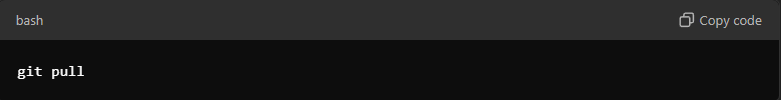

Project Information Dev

# ZUnreal-Engine-PinBall-GAme

This repository contains an Unreal Engine Pinball game project. Follow the steps below to clone and set up the project on your local machine.

## Prerequisites

Before you begin, make sure you have the following installed:

- [Git](https://git-scm.com/downloads)
- [Git LFS](https://git-lfs.github.com/) (Git Large File Storage)
- [Unreal Engine](https://www.unrealengine.com/en-US/download) (ensure you have the appropriate version used for this project)

## Cloning the Repository

1. **Install Git LFS** if you haven't already. This step is crucial, as some of the files in this project are managed by Git LFS:
   ```bash
   git lfs install

git clone https://github.com/KassieSanisclaws/ZUnreal-Engine-PinBall-GAme.git

cd ZUnreal-Engine-PinBall-GAme


Setting Up the Project in Unreal Engine
Open Unreal Engine.
Select "Open Project" and browse to the cloned directory. Open the .uproject file in the root of the project directory.
Important Notes
This project uses Git LFS for handling large files such as .uasset and .umap. Make sure you've installed Git LFS before pulling the repository to avoid issues with missing or incomplete files.
If you encounter any issues, make sure you have the correct version of Unreal Engine installed, as using a different version can cause compatibility issues.
Updating the Project
To update your local copy with the latest changes, run:




